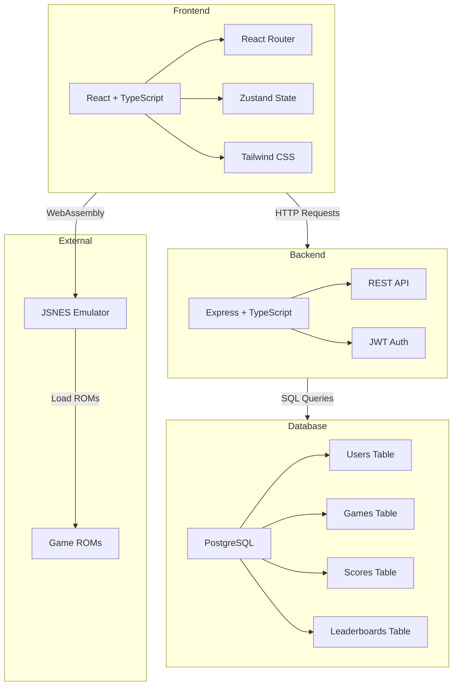
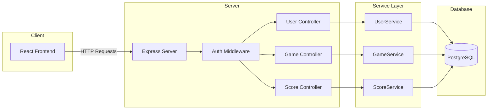
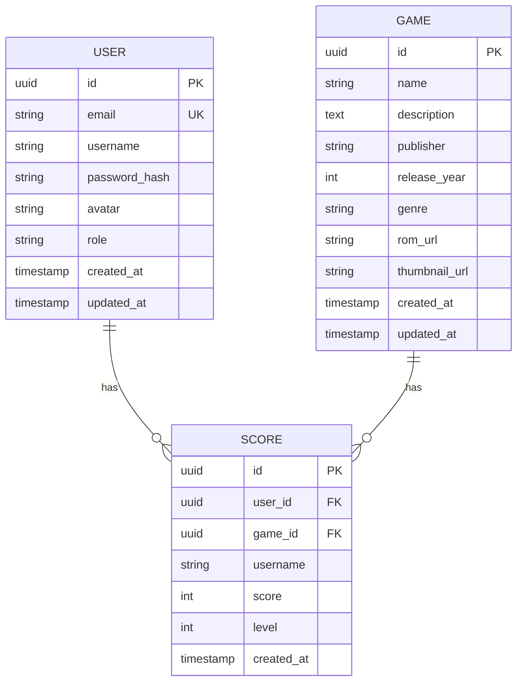

# 红白机经典游戏网站 - 技术架构文档

## 1. 架构设计



## 2. 技术栈

- **前端**: React@18 + TypeScript + Vite + TailwindCSS@3 + Zustand + React Router@6
- **后端**: Express@4 + TypeScript + JWT
- **数据库**: PostgreSQL@15
- **模拟器核心**: JSNES (JavaScript实现的NES模拟器)
- **游戏ROM**: 经典红白机游戏ROM文件(通过CDN或本地存储)
- **认证**: JWT Token + bcrypt密码加密
- **开发工具**: ESLint + Prettier + Husky

## 3. 路由定义

| 路由 | 用途 |
|------|------|
| / | 首页 - 展示热门游戏和导航 |
| /games | 游戏列表页 - 所有游戏展示和搜索 |
| /game/:id | 游戏详情页 - 游戏信息和模拟器 |
| /leaderboard | 排行榜页 - 所有游戏排名 |
| /game/:id/leaderboard | 特定游戏排行榜 |
| /login | 用户登录页 |
| /register | 用户注册页 |
| /profile | 用户中心 - 个人信息和成绩 |
| /admin | 管理后台 - 游戏和用户管理 |

## 4. API定义

### 4.1 用户相关API

```typescript
// 用户类型定义
interface User {
  id: string;
  email: string;
  username: string;
  avatar?: string;
  role: 'user' | 'admin';
  createdAt: string;
  updatedAt: string;
}

// 注册
interface RegisterRequest {
  email: string;
  password: string;
  username: string;
}

interface RegisterResponse {
  user: User;
  token: string;
}

// 登录
interface LoginRequest {
  email: string;
  password: string;
}

interface LoginResponse {
  user: User;
  token: string;
}

// 获取用户信息
interface GetUserResponse {
  user: User;
}
```

### 4.2 游戏相关API

```typescript
// 游戏类型定义
interface Game {
  id: string;
  name: string;
  description: string;
  publisher: string;
  releaseYear: number;
  genre: string;
  romUrl: string;
  thumbnailUrl: string;
  createdAt: string;
  updatedAt: string;
}

// 获取所有游戏
interface GetAllGamesResponse {
  games: Game[];
  total: number;
}

// 获取单个游戏
interface GetGameResponse {
  game: Game;
}
```

### 4.3 排行榜相关API

```typescript
// 分数记录类型
interface Score {
  id: string;
  userId: string;
  gameId: string;
  username: string;
  score: number;
  level?: number;
  createdAt: string;
}

// 提交分数
interface SubmitScoreRequest {
  gameId: string;
  score: number;
  level?: number;
}

interface SubmitScoreResponse {
  score: Score;
  rank: number;
}

// 获取排行榜
interface GetLeaderboardResponse {
  scores: Score[];
  total: number;
  userRank?: number;
}
```

## 5. 服务器架构



## 6. 数据模型

### 6.1 数据模型定义



### 6.2 数据定义

```sql
-- 用户表
CREATE TABLE users (
    id UUID PRIMARY KEY DEFAULT gen_random_uuid(),
    email VARCHAR(255) UNIQUE NOT NULL,
    username VARCHAR(100) UNIQUE NOT NULL,
    password_hash VARCHAR(255) NOT NULL,
    avatar VARCHAR(500),
    role VARCHAR(20) DEFAULT 'user' CHECK (role IN ('user', 'admin')),
    created_at TIMESTAMP DEFAULT NOW(),
    updated_at TIMESTAMP DEFAULT NOW()
);

-- 游戏表
CREATE TABLE games (
    id UUID PRIMARY KEY DEFAULT gen_random_uuid(),
    name VARCHAR(255) NOT NULL,
    description TEXT,
    publisher VARCHAR(255),
    release_year INTEGER,
    genre VARCHAR(100),
    rom_url VARCHAR(500) NOT NULL,
    thumbnail_url VARCHAR(500),
    created_at TIMESTAMP DEFAULT NOW(),
    updated_at TIMESTAMP DEFAULT NOW()
);

-- 分数记录表
CREATE TABLE scores (
    id UUID PRIMARY KEY DEFAULT gen_random_uuid(),
    user_id UUID NOT NULL REFERENCES users(id) ON DELETE CASCADE,
    game_id UUID NOT NULL REFERENCES games(id) ON DELETE CASCADE,
    username VARCHAR(100) NOT NULL,
    score INTEGER NOT NULL,
    level INTEGER,
    created_at TIMESTAMP DEFAULT NOW()
);

-- 索引优化
CREATE INDEX idx_scores_game_id ON scores(game_id);
CREATE INDEX idx_scores_user_id ON scores(user_id);
CREATE INDEX idx_scores_score ON scores(game_id, score DESC);

-- 初始游戏数据
INSERT INTO games (name, description, publisher, release_year, genre, rom_url, thumbnail_url) VALUES
('超级马里奥兄弟', '经典平台跳跃游戏', 'Nintendo', 1985, 'Platform', '/roms/mario.nes', '/images/mario.png'),
('魂斗罗', '经典射击游戏', 'Konami', 1988, 'Shooter', '/roms/contra.nes', '/images/contra.png'),
('洛克人', '经典动作游戏', 'Capcom', 1987, 'Action', '/roms/rockman.nes', '/images/rockman.png'),
('塞尔达传说', '经典冒险游戏', 'Nintendo', 1986, 'Adventure', '/roms/zelda.nes', '/images/zelda.png'),
('超级马里奥兄弟2', '马里奥续作', 'Nintendo', 1988, 'Platform', '/roms/mario2.nes', '/images/mario2.png'),
('恶魔城', '经典动作冒险游戏', 'Konami', 1989, 'Action', '/roms/castlevania.nes', '/images/castlevania.png'),
('冒险岛', '经典平台游戏', 'Hudson', 1986, 'Platform', '/roms/adventure.nes', '/images/adventure.png'),
('坦克大战', '经典策略射击游戏', 'Nintendo', 1985, 'Strategy', '/roms/tank.nes', '/images/tank.png');
```

## 7. 项目结构

```
game/
├── api/                      # 后端代码
│   ├── src/
│   │   ├── controllers/     # 控制器
│   │   ├── middleware/      # 中间件(认证等)
│   │   ├── routes/          # 路由定义
│   │   ├── services/        # 业务逻辑
│   │   ├── utils/           # 工具函数
│   │   └── app.ts           # Express应用入口
│   ├── package.json
│   └── tsconfig.json
├── src/                      # 前端代码
│   ├── components/          # 通用组件
│   ├── hooks/               # 自定义Hooks
│   ├── pages/               # 页面组件
│   ├── stores/              # Zustand状态管理
│   ├── utils/               # 工具函数
│   ├── types/               # TypeScript类型定义
│   ├── App.tsx              # 主应用组件
│   └── main.tsx             # 入口文件
├── .trae/documents/         # 项目文档
├── package.json             # 项目依赖
├── tsconfig.json            # TypeScript配置
├── vite.config.ts           # Vite配置
└── tailwind.config.js       # Tailwind配置
```
